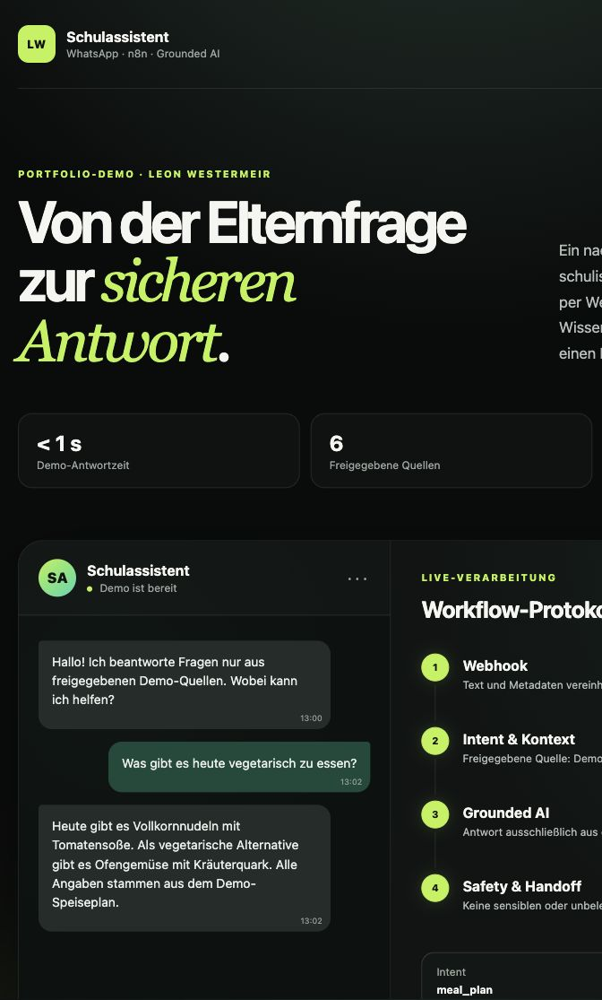
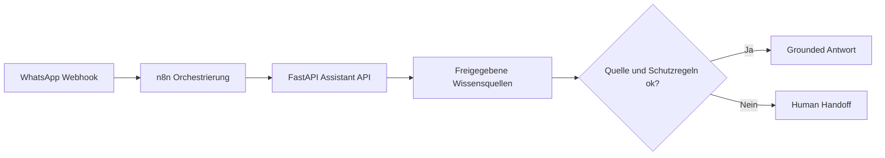

# WhatsApp-Schulassistent – n8n / Grounded-AI Demo

Lauffähiger Portfolio-MVP für einen schulischen WhatsApp-Assistenten. Die Demo
zeigt den vollständigen Kernprozess:



1. Eingang einer WhatsApp-ähnlichen Nachricht per Webhook
2. Normalisierung und transparente Intent-Erkennung
3. Abruf einer freigegebenen Wissensquelle
4. Grounded Answering ohne erfundene Inhalte
5. Sicherheitsprüfung und Human Handoff
6. Importierbarer n8n-Workflow als Integrationsschicht

Die Anwendung verwendet ausschließlich synthetische Daten und läuft ohne
externe KI- oder Messaging-Kosten. Der Offline-Modus ist bewusst deterministisch,
damit die Vorführung zuverlässig ist. In einer Produktionsumsetzung wird der
gekennzeichnete Antwortschritt durch OpenAI mit dem abgerufenen Kontext ersetzt
und über die WhatsApp Cloud API ausgeliefert.



## Schnellstart

```bash
cd /Users/leonwestermeir/Documents/whatsapp-school-assistant-demo
python3 -m venv .venv
source .venv/bin/activate
pip install -r requirements.txt
uvicorn app.main:app --reload
```

Danach:

- Demo-Oberfläche: http://127.0.0.1:8000
- API-Dokumentation: http://127.0.0.1:8000/docs
- Healthcheck: http://127.0.0.1:8000/api/health

## Tests

```bash
source .venv/bin/activate
pytest -q
```

## API-Beispiel

```bash
curl -s http://127.0.0.1:8000/webhooks/whatsapp \
  -H 'Content-Type: application/json' \
  -d '{
    "from_number": "+4915112345678",
    "message_id": "wamid.demo-001",
    "text": "Wie kann ich mein Kind krankmelden?"
  }'
```

## n8n-Workflow

Die Datei
[`workflows/n8n-school-whatsapp-assistant.json`](workflows/n8n-school-whatsapp-assistant.json)
kann in n8n importiert werden. Der Demo-Flow sendet eine synthetische Nachricht
an die lokale API und verzweigt abhängig von `escalated` in:

- vorbereitete WhatsApp-Antwort
- Übergabe an das Sekretariat

Wenn n8n in Docker läuft, ist die Demo-API über
`http://host.docker.internal:8000` erreichbar. Bei einer lokalen n8n-Installation
wird die URL im HTTP-Request-Node auf `http://127.0.0.1:8000` geändert.

## Produktionsgrenzen

Vor einem echten Einsatz werden mindestens benötigt:

- verifiziertes Meta-WhatsApp-Business-Konto
- abgestimmte Rechtsgrundlage und Datenschutzkonzept
- Rollen, Löschfristen und minimierte Protokollierung
- OpenAI-Zugang mit klarer Datenverarbeitung und freigegebenem Modell
- versionierte Wissensquellen und Freigabeprozess
- Monitoring, Wiederholungslogik und Tests mit realistischen Grenzfällen

## Gesprächsvorbereitung

Ein kurzer Vorführablauf und konkrete Discovery-Fragen stehen in
[`DEMO-GESPRAECH.md`](DEMO-GESPRAECH.md).
